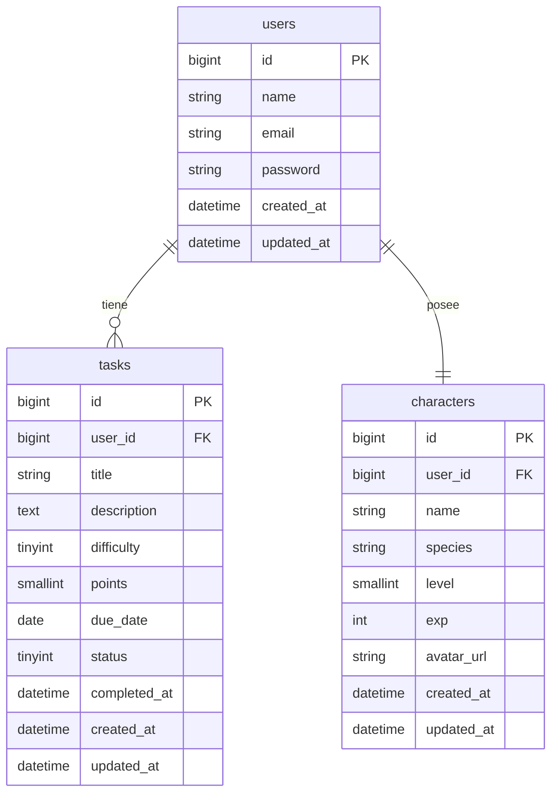

# Gamificación — Laravel 10 (ES/EN)

> Proyecto base para una app de **tareas gamificadas** con Laravel 10, MySQL y Blade. Incluye modelos, migraciones, controladores, vistas mínimas, factories/seeders y SQL opcional.

---

## 🧭 TL;DR — Quickstart

```bash
# 1) Dependencias
composer install
cp .env.example .env

# 2) .env (Laragon por defecto)
# DB_CONNECTION=mysql
# DB_HOST=127.0.0.1
# DB_PORT=3306
# DB_DATABASE=gamificacion
# DB_USERNAME=root
# DB_PASSWORD=

# 3) Clave de app
php artisan key:generate

# 4) Infra en BD (si usas drivers database)
php artisan session:table
php artisan cache:table
php artisan queue:table
php artisan queue:failed-table

# 5) Migraciones + datos
php artisan migrate:fresh --seed

# 6) Levantar
php artisan serve
# http://127.0.0.1:8000
```

**Rutas clave**

* `/character` → personaje del usuario
* `/tasks/today` → tareas pendientes de hoy
* `/tasks/completed-week` → tareas completadas de la semana
* `/tasks` → CRUD completo (except `show`)

---

## 🧱 ER Diagram (Mermaid)



---

## 📦 Modelos (Models)

* **User**: `hasOne(Character)`, `hasMany(Task)`
* **Character**: `belongsTo(User)` — 1:1 con `UNIQUE(user_id)`; campos `level`, `exp`, `avatar_url`.
* **Task**: `belongsTo(User)` — scopes útiles: `pending()`, `today()`, `completedThisWeek()`; `completed_at` cuando pasa a completada.

---

## 🎯 Controladores & Rutas (Controllers & Routes)

**CharacterController**

* `show()` → GET `/character` → `character.show`

**TaskController**

* `today()` → GET `/tasks/today` → `tasks.today`
* `completedWeek()` → GET `/tasks/completed-week` → `tasks.completedWeek`
* `index()`/`create()`/`store()`/`edit()`/`update()`/`destroy()` → recurso `/tasks`

**Rutas sugeridas** (`routes/web.php`)

```php
Route::middleware(['web'])->group(function () {
    Route::get('/character', [CharacterController::class, 'show'])->name('character.show');
    Route::get('/tasks/today', [TaskController::class, 'today'])->name('tasks.today');
    Route::get('/tasks/completed-week', [TaskController::class, 'completedWeek'])->name('tasks.completedWeek');
    Route::resource('tasks', TaskController::class)->except(['show']);
    Route::get('/', fn () => redirect()->route('tasks.today'))->name('home');
});
```

> En productivo usa `auth` como middleware. O instala **Breeze**: `composer require laravel/breeze --dev && php artisan breeze:install blade`.

---

## 🖼️ Vistas (Views)

* `resources/views/character/show.blade.php` → Perfil de personaje (name, species, level, exp, avatar)
* `resources/views/tasks/today.blade.php` → Pendientes del día (scopes `pending() + today()`)
* `resources/views/tasks/completed_week.blade.php` → Completadas semana (scope `completedThisWeek()`)
* Layout mínimo: `resources/views/layouts/plain.blade.php`

---

## 🌱 Seeders & Factories

* **DatabaseSeeder** crea:

  * Usuario demo: `maravilla@example.com` / `password`
  * Personaje 1:1 (nivel 1, exp 0)
  * ~16 tareas (10 random + 3 hoy pendientes + 3 semana completadas)
* **Factories**

  * `CharacterFactory` / `TaskFactory` con `completed_at` si `status=COMPLETED`

**Comandos**

```bash
php artisan db:seed
# o full reset
php artisan migrate:fresh --seed
```

---

## 🗄️ SQL Opcional (DDL + DML)

**Creación**

```sql
CREATE DATABASE IF NOT EXISTS gamificacion CHARACTER SET utf8mb4 COLLATE utf8mb4_unicode_ci;
USE gamificacion;

CREATE TABLE IF NOT EXISTS users (
  id BIGINT UNSIGNED AUTO_INCREMENT PRIMARY KEY,
  name VARCHAR(255) NOT NULL,
  email VARCHAR(255) NOT NULL UNIQUE,
  email_verified_at TIMESTAMP NULL,
  password VARCHAR(255) NOT NULL,
  remember_token VARCHAR(100) NULL,
  created_at TIMESTAMP NULL,
  updated_at TIMESTAMP NULL
) ENGINE=InnoDB;

CREATE TABLE IF NOT EXISTS characters (
  id BIGINT UNSIGNED AUTO_INCREMENT PRIMARY KEY,
  user_id BIGINT UNSIGNED NOT NULL UNIQUE,
  name VARCHAR(255) NOT NULL,
  species VARCHAR(255) NOT NULL DEFAULT 'Humano',
  level SMALLINT UNSIGNED NOT NULL DEFAULT 1,
  exp INT UNSIGNED NOT NULL DEFAULT 0,
  avatar_url VARCHAR(255) NULL,
  created_at TIMESTAMP NULL,
  updated_at TIMESTAMP NULL,
  CONSTRAINT fk_char_user FOREIGN KEY (user_id) REFERENCES users(id) ON DELETE CASCADE
) ENGINE=InnoDB;

CREATE TABLE IF NOT EXISTS tasks (
  id BIGINT UNSIGNED AUTO_INCREMENT PRIMARY KEY,
  user_id BIGINT UNSIGNED NOT NULL,
  title VARCHAR(255) NOT NULL,
  description TEXT NULL,
  difficulty TINYINT NOT NULL DEFAULT 1,
  points SMALLINT UNSIGNED NOT NULL DEFAULT 10,
  due_date DATE NOT NULL,
  status TINYINT NOT NULL DEFAULT 0,
  completed_at DATETIME NULL,
  created_at TIMESTAMP NULL,
  updated_at TIMESTAMP NULL,
  INDEX idx_tasks_user_due (user_id, due_date),
  INDEX idx_tasks_status_completed (status, completed_at),
  CONSTRAINT fk_tasks_user FOREIGN KEY (user_id) REFERENCES users(id) ON DELETE CASCADE
) ENGINE=InnoDB;
```

**Datos mínimos**

```sql
INSERT INTO users (name,email,password,created_at,updated_at) VALUES
('Maravilla','maravilla@example.com','$2y$12$92IXUNpkjO0rOQ5byMi.Ye4oKoEa3Ro9llC/.og/at2.uheWG/igi',NOW(),NOW());

SET @uid = (SELECT id FROM users WHERE email='maravilla@example.com' LIMIT 1);
INSERT INTO characters (user_id,name,species,level,exp,avatar_url,created_at,updated_at)
VALUES (@uid,'Héroe Zero','Humano',1,0,NULL,NOW(),NOW());

INSERT INTO tasks (user_id,title,description,difficulty,points,due_date,status,completed_at,created_at,updated_at) VALUES
(@uid,'Leer documentación Laravel','Repasar Eloquent y Factories',2,20,CURDATE(),0,NULL,NOW(),NOW()),
(@uid,'Crear migraciones','characters y tasks',3,30,CURDATE(),0,NULL,NOW(),NOW()),
(@uid,'Refactorizar modelo Task',NULL,2,15,DATE_SUB(CURDATE(), INTERVAL 1 DAY),1,NOW(),NOW(),NOW());
```

---

## 🛡️ Troubleshooting

* **MissingAppKeyException** →

  ```bash
  php artisan key:generate && php artisan optimize:clear && php artisan config:cache
  ```
* **Base table already exists** → tablas creadas a mano; usa:

  ```bash
  php artisan migrate:fresh --seed
  ```
* **Unknown column ...** → drift de esquema; guarda la migración y vuelve a migrar.
* **Access denied (1045)** → credenciales `.env`; en Laragon root sin contraseña.
* **No conecta (10061)** → MySQL caído o puerto mal; verifica 3306.

---

## 🔐 Auth (opcional, recomendado)

```bash
composer require laravel/breeze --dev
php artisan breeze:install blade
npm install && npm run dev
php artisan migrate
# login con el usuario seed (maravilla@example.com / password)
```

---

## 🗺️ Roadmap corto

* Regla **XP/Level-up** al completar tarea (sumar `points` a `exp`, subir `level` por umbrales)
* Badges/achievements por rachas semanales
* Gráficas de productividad por semana/mes

---

## 🇬🇧 English Summary (one page)

* **Stack:** Laravel 10 + MySQL + Blade. Seeders/factories and optional raw SQL included.
* **Models:** `User (1—1 Character, 1—N Task)`, `Character (level, exp, avatar)`, `Task (difficulty, points, due_date, status, completed_at)`.
* **Controllers:** `CharacterController@show`, `TaskController@today|completedWeek|index|create|store|edit|update|destroy`.
* **Views:** character profile, today backlog, weekly completed, minimal layout.
* **DB:** FKs with cascades, composite indexes; scopes for today/weekly queries.
* **Setup:** `.env` for MySQL (Laragon default), `key:generate`, infra tables (sessions/cache/queues), `migrate:fresh --seed`, `serve`.
* **Troubleshooting:** app key cache, schema drift, duplicate tables, DB access.

---

## Licencia

Uso educativo/demostrativo. Ajusta a tu licencia preferida si publicas el repositorio.
